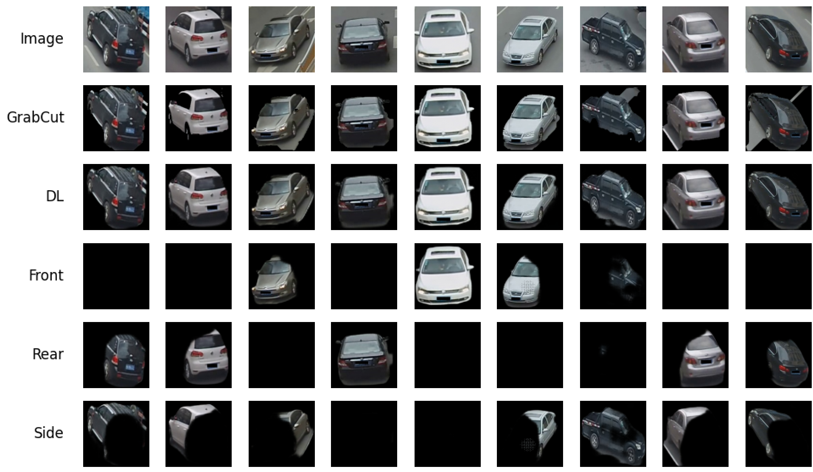

# Semantics-guided Part Attention Network
This is the pytorch implementatin of Semantics-guided Part Attention Network **(SPAN)**

## Paper
Orientation-aware Vehicle Re-identification with Semantics-guided Part Attention Network <br/>
[Tsai-Shien Chen](https://tsaishien-chen.github.io/), [Chih-Ting Liu](https://jackie840129.github.io/), Chih-Wei Wu, and [Shao-Yi Chien](http://www.ee.ntu.edu.tw/profile?id=101) <br/>
European Conference on Computer Vision (**ECCV**), **Oral**, 2020 <br/>
[[Paper Website]](http://media.ee.ntu.edu.tw/research/SPAN/) [[arXiv]](https://arxiv.org/abs/2008.11423)

### Citation
If you use SPAN, please cite this paper:
```
@inproceedings{SPAN,
    title        = {Orientation-aware Vehicle Re-identification with Semantics-guided Part Attention Network},
    author       = {Chen, Tsai-Shien and Liu, Chih-Ting and Wu, Chih-Wei and Chien, Shao-Yi},
    booktitle    = {European Conference on Computer Vision},
    pages        = {330--346},
    year         = {2020},
    organization = {Springer}
}
```

## Visualization Example
We visiualize some examples of vehicle images and their
- foreground masks generated by grabcut,
- foreground masks generated by deep learning network,
- front, rear and side attention masks.
<p align="center"></p>

## Get Started
### Prerequisites
- Download VeRi-776 dataset [[link]](https://github.com/JDAI-CV/VeRidataset) </br>
*Please note that our code is **only supported on VeRi-776** dataset currently.*
- Download this repo by:
```
$ git clone https://github.com/tsaishien-chen/SPAN.git
$ cd SPAN
```
- We run the code under Python 3.6.9
- The versions of used python packages are listed in `requirements.txt`. You can install all the dependancies by:
```
$ sed -i 's/==/>=/g' requirements.txt
$ pip3 install -r requirements.txt
```
### Train
To train the model from scratch, please run
```
$ python3 main.py --mode train --image_root <Path_to_VeRi>
```
For example,
```
$ python3 main.py --mode train --image_root ../Dataset/VeRi
```
The whole training process includes five steps:
1. generating the foreground masks by grabcut,
2. training network to generate more robust foreground mask,
3. generating the foreground masks by deep learning network,
4. training network to generate part (front, rear and side) attention mask, and
5. generating part attention masks.

### Implement
We have given the pretrained model of part attention generator; </br>
therefore, you can simply generate the part attention mask without training by
```
$ python3 main.py --mode implement --image_root <Path_to_VeRi>
```
For example,
```
$ python3 main.py --mode implement --image_root ../Dataset/VeRi
```

### Visualize
After training and implementation process, the code will automatically visualize generated masks as above. </br>
Or, you can uncomment the `visualize` function in `main.py` and can independently visualize the masks after being generated in each step.

## Contact
[Tsai-Shien Chen](https://tsaishien-chen.github.io/), [Media IC and System Lab](http://media.ee.ntu.edu.tw/), [National Taiwan University](https://www.ntu.edu.tw/english/index.html) </br>
E-mail : tschen@media.ee.ntu.edu.tw
